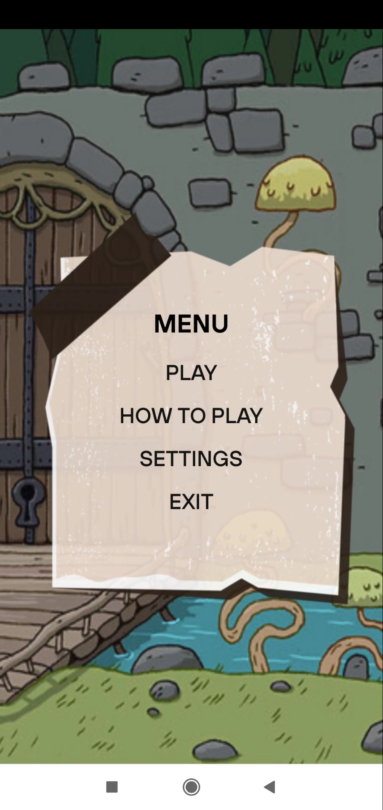
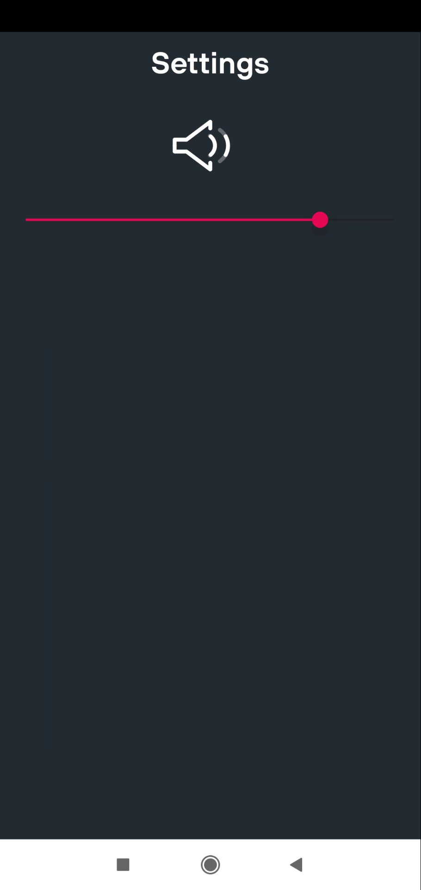
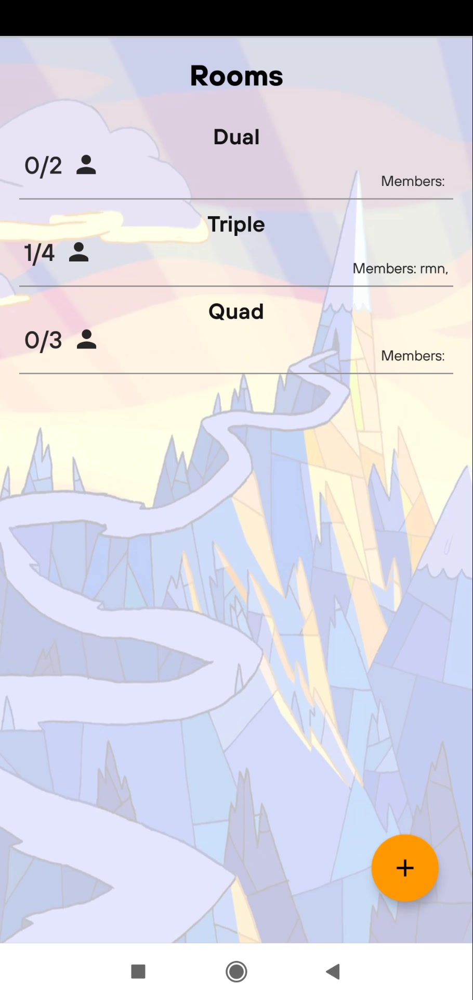
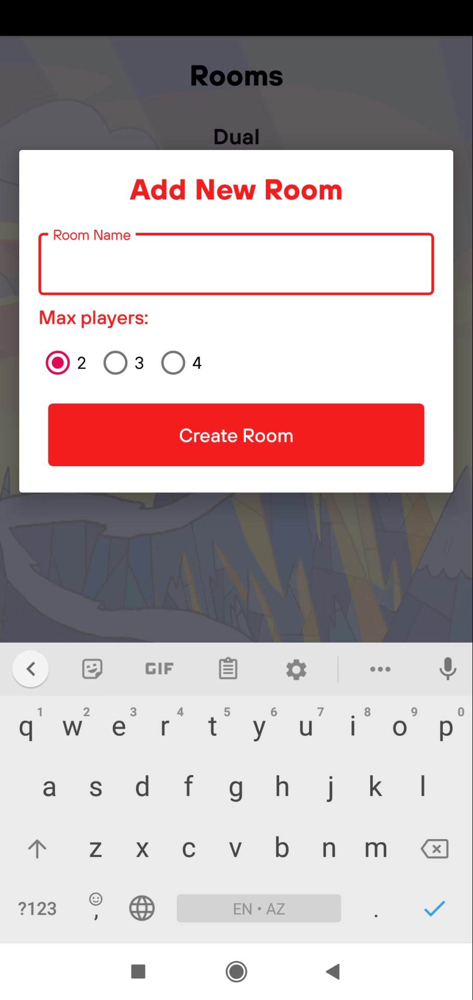
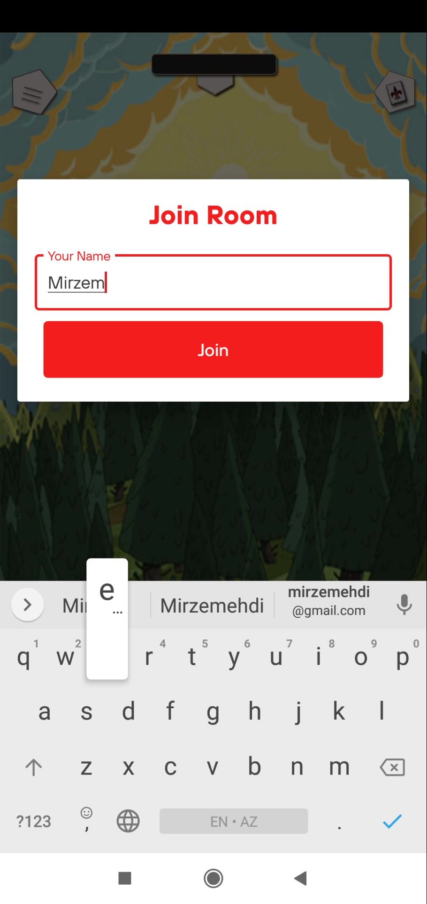
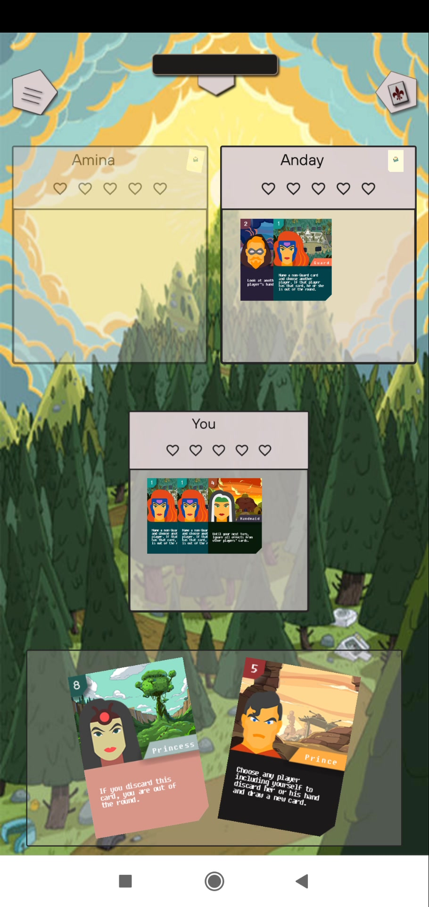

# Love Letter Card Game
This is Love Letter Card game for Android device which is developed  during my education in UFAZ for Software Engineering project.
Love Letter Card Game is played between 2 and 4 players. Any player can create or join existing room, there is no need to register or
login to play this game. It is used sockets to see real-time changes in the game. Project is written in ***Kotlin*** and in ***MVP*** pattern to make
test or adding new functionality easier.  

Feel free to download and play this game :)  
   
## Demo   
Video link: https://drive.google.com/open?id=1Mk2-s4t2ImMj8nzjqtoh0NpMS6Ah3Sw8
  
### Screenshots from the game

  
"  "
"  "   
"  "
"  "

### Installing
apk link:  https://github.com/mirzemehdi/LoveLetterCardGame/raw/master/apk/love_letter_card_game.apk

## Used Libraries
**Socket library**  - to see changes real-time in the game  
**Toasty**  - to see messages like success,warnings or errors with toast but with steroids     
**RecylerView** - to see room list   
**CardView**  
**Material Design**  

### More Detail in project
To provide clear data flow which will increase robustness, scalability, bug resistant, increase readability, 
easy to modify and increase productivity and provide a quality app it is chosen **MVP** pattern to develop this Love Letter game,
without any patterns it becomes  difficult just change some part of code in the project. To get data from back-end and to make
it real-time it is used **Socket library** where each user can see any changes during a game instantly. The main game logic is done
in back-end. While developing this game it is focused to use less activities , but more fragments to make transitions between screens smoothly. 
Lots of animations are used in this game like *card flip animation, card move animation, give a card to player or all players animation, 
discard card of player animation* and etc. 

